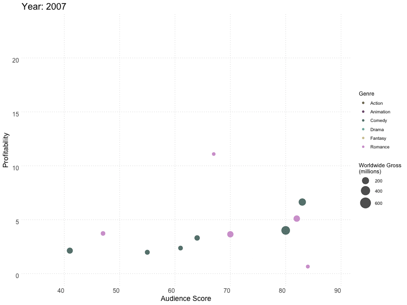
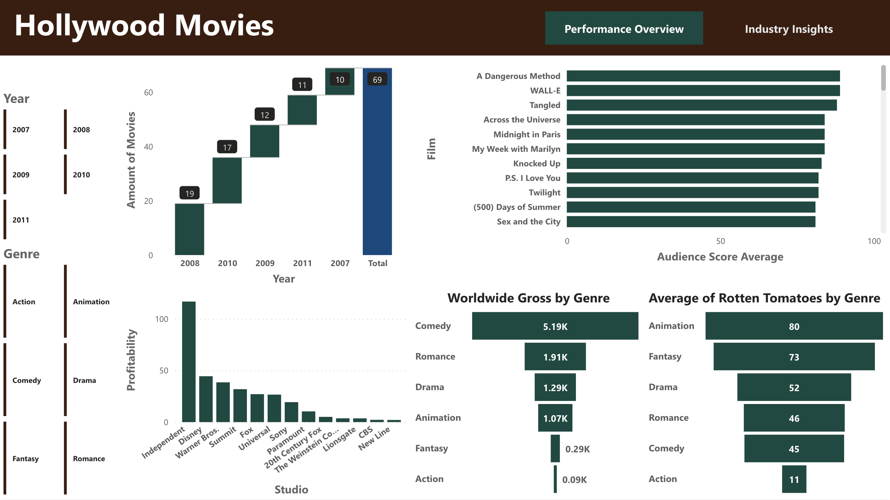
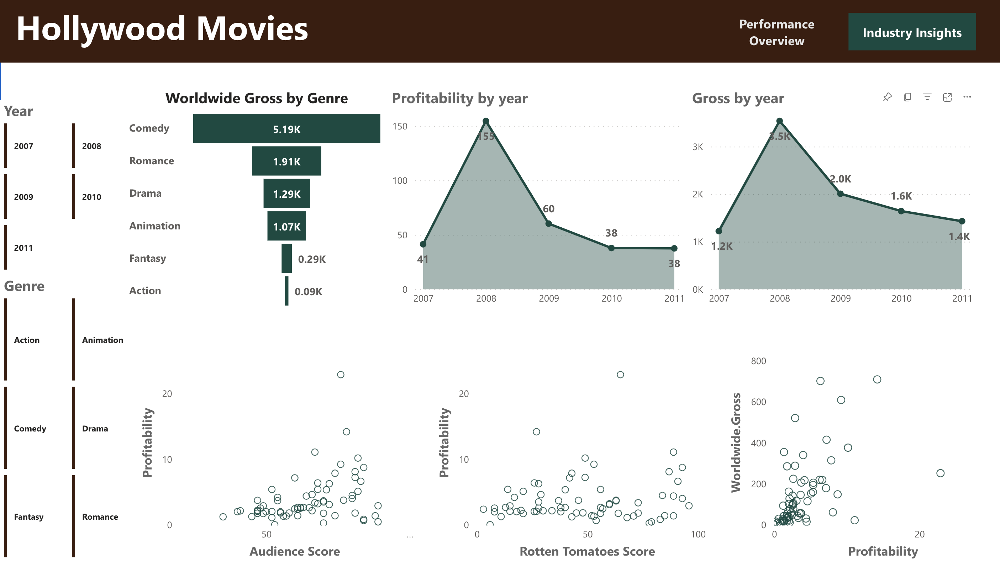
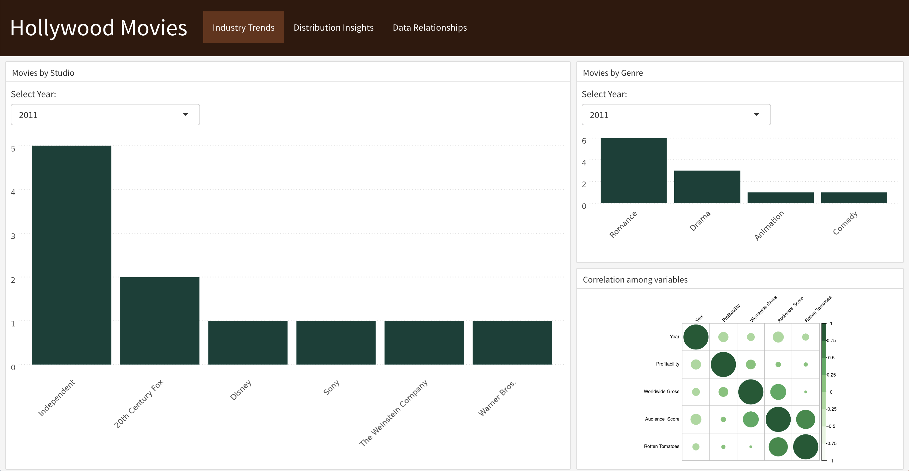
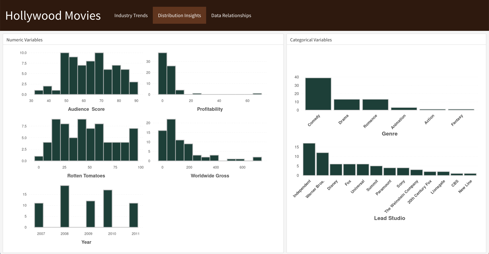
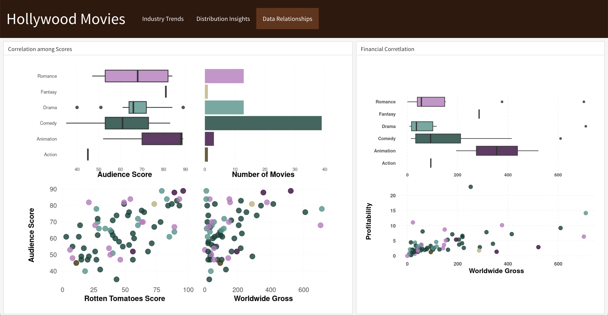

# Hollywood Movies Performance Analysis

The goal of this project is to analyze the performance of Hollywood movies, focusing on a dataset of films released between 2007 and 2012. I intend to explore various attributes that may influence a movie's success, such as title, genre, production studio, profitability, and ratings.

## Data Source
The data used in this analysis comes from [InformationIsBeautiful.net](https://public.tableau.com/app/sample-data/HollywoodsMostProfitableStories.csv). This dataset includes information on the title, genre, studio, profitability, and ratings of the movies.

The dataset includes the following fields for each movie:

| Variable Name   | Description                                                    | Data Type |
|-----------------|----------------------------------------------------------------|-----------|
| Film            | Title of the movie                                             | String    |
| Genre           | Genre of the movie                                             | String    |
| Lead Studio     | Studio that produced the movie                                 | String    |
| Audience Score  | Audience score of the movie            | Integer   |
| Profitability   | Profitability of the movie (likely a ratio or multiple of cost) | Float     |
| Rotten Tomatoes | Rotten Tomatoes score of the movie                | Integer   |
| Worldwide Gross | Worldwide gross revenue of the movie (in millions of USD)      | Float     |
| Year            | Year the movie was released                                    | Integer   |

## Analysis Tools

To conduct this analysis, interactive dashboards have been developed using the following tools:

- **Power BI:** An interactive dashboard to visualize and explore the different aspects of movie performance.
- **Flexboard for R:** A complementary tool specifically designed for R users, offering detailed visualizations and specific analyses of movie performance.

## Methodology

The methodology for this analysis involved both initial data exploration and cleaning steps to ensure data quality and integrity. The process is outlined as follows:

### Data Cleaning and Exploration

1. **Initial Data Exploration:**
   - Utilized R libraries `tidyverse` and `dplyr` for data manipulation.
   - Loaded the dataset and performed initial exploratory analysis to understand data structure and content.

2. **Data Quality Checks:**
   - Examined the dataset for missing values, unique distributions of categorical variables, and summary statistics to get an initial understanding of the data.

3. **Cleaning Steps:**
   - Identified and removed rows with missing values to ensure the analysis is based on complete cases only.
   - Used `summary` to review the dataset post-cleaning, ensuring that the cleaning process preserved the integrity of the data.

### Power BI Processing

- In Power BI, used the Power Query Editor to further clean the data by removing a row with an empty value, aligning the dataset for accurate analysis.

This comprehensive approach to data preparation set the stage for insightful analysis conducted through interactive dashboards in Power BI and Flexboard for R, enabling a deep dive into the performance metrics of Hollywood movies.

## Key Findings

A brief overview of the most interesting insights obtained from the analysis, such as trends in genres, the most profitable studios, and how ratings impact profitability.

### Power BI Dashboards

#### Performance Overview

- **Worldwide Gross by Genre:** Comedy leads in gross revenue across the years, indicating a strong audience preference.
- **Profitability by Year:** A significant peak in profitability was observed in 2009, which warrants further investigation into market trends or standout movies from that year.
- **Gross by Year:** There is a noticeable fluctuation in gross revenue over the years, with a peak in 2009 followed by a decline.

#### Industry Insights

- **Movies by Studio:** The data indicates a varied distribution of movie counts by studio, with Independent studios contributing a significant number of movies.
- **Audience Score Average and Rotten Tomatoes Scores by Genre:** There is an interesting correlation between audience scores and critic scores, with animation scoring high on both.

### R Dashboards

#### Industry Trends

- **Movies by Genre:** The distribution of movies across genres over the years shows a consistent production of drama and comedy films.
- **Movies by Studio:** Data reveals that certain studios, such as Warner Bros. and Sony, are more prolific in certain years.

#### Distribution Insights

 

Numeric Variables:
- **Audience Score:** This histogram displays the distribution of audience scores, offering insight into viewer preferences and satisfaction.
- **Profitability:** The profitability distribution indicates how often movies achieve different levels of financial success relative to their cost.
- **Rotten Tomatoes:** By showcasing the spread of critic scores, we gain an understanding of critical reception across the dataset.
- **Worldwide Gross:** This graph explores the range of worldwide revenues, highlighting the economic impact of the films featured.
- **Year:** The number of movies released per year is displayed, illustrating changes in production volume over time.

Categorical Variables:
- **Genre:** A bar chart breaks down movie counts by genre, providing a visual summary of genre popularity and market saturation.
- **Lead Studio:** This visualization compares the number of movies produced by each studio, reflecting industry competition and studio prominence.

These visual distributions are crucial for stakeholders looking to understand market tendencies, audience and critic perceptions, and the financial landscape of the film industry. 

#### Data Relationships

- **Correlation among Scores:** There is a variable relationship between audience scores and Rotten Tomatoes scores, suggesting different factors influence critics and audiences.
- **Financial Correlation:** Profitability doesn't always align with high gross revenue, indicating that some high-earning movies are not necessarily the most profitable when considering production costs.

These insights are crucial for understanding industry trends and can assist stakeholders in making informed decisions about movie production and investment strategies.

## Access to Dashboards

### Power BI Dashboard Usage

For the most seamless experience with the Power BI dashboard, there are two recommended options:

1. **Download the Power BI file:**
   You can download the Power BI dashboard file from the repository to interact with it locally on your machine. To do this, follow these steps:
   - Navigate to the repository.
   - Locate the Power BI file (.pbix extension).
   - Download the file to your computer.
   - Open the file using Power BI Desktop (installation of Power BI Desktop is required).

2. **Access through the repository:**
   The repository contains all the necessary files for a comprehensive analysis. You can clone or download the repository to ensure you have all the scripts, datasets, and the Power BI file for local execution and further development.

Please ensure you have the necessary permissions and access to view or download the files from the repository.

### Flexboard for R

The interactive Flexboard dashboard for R can be accessed online via the following link: [Flexboard Dashboard](https://albertevieites.shinyapps.io/hollywood_movies/)

#### Accessing the Dashboard
- Click on the provided link to open the Flexboard in your web browser.
- No installation or local R environment is needed, as the dashboard is hosted online for ease of access.

#### Interacting with the Dashboard
- Navigate through the various tabs to explore different data visualizations.
- Use the interactive elements such as dropdowns to filter and drill down into specific data views.

Please note that the link might require internet access. 

## Contribution Guidelines
To contribute, please fork the repository and submit a pull request with your suggested changes. For major changes, please open an issue first to discuss what you would like to change.

## Contact Information
For support or queries, reach out to me at [my email address](mailto:albertevieites@gmail.com).

## Acknowledgements
Special thanks to [Yusuf Satilmis](https://github.com/yusufsjustit) for his invaluable assistance in this project.
